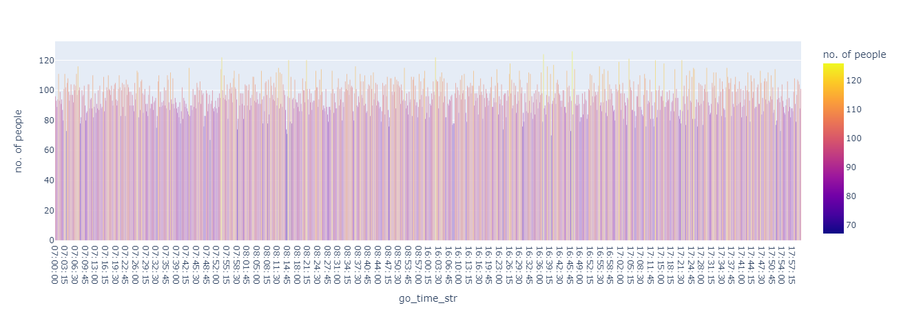

# chattanooga-od-sample

The geographic area under consideration is the Hamilton county, Tennessee. The county is further divided into census tracts(larger, poor resolution) and census block groups (CBGs) (smaller, better resolution). We find the movement matrix of people travelling for jobs (LODES), or general purposes (Safegraph).

## The data

1. Geographic data

The geographic data of Hamilton county defines the area and boundaries of the census tracts and CBGs. It also provides unique GEOIDs for each zone under consideration, which we can further use to find relevant regions in other datasets. It is initially in .shp format and has been stored in [ham_cbg.csv](data/ham_cbg.csv).

2. People movement 
  a. [LODES dataset](data/hamilton_lodes_2019.zip)  
  b. Safegraph dataset (our data is for Jan 2021-Mar2021)

These provide the information about the movement of people (the number of people moving, and their origin and destination CBG). 

3. Residential and Work locations

    The locations of residential and commercial(work) areas are obtained from OpenStreetMaps(OSM). They are obtained by using the [OSM Accomodation tags](https://wiki.openstreetmap.org/wiki/Key:building#Accommodation) and the python library OSMNX. The associated file is ([residential_locations.csv](data/ham_residential_buildings2.csv))
    
    The work locations are obtained as a combination of the tags [commercial](https://wiki.openstreetmap.org/wiki/Key:building#Commercial), [civic/amenity](https://wiki.openstreetmap.org/wiki/Key:building#Civic/amenity), and the Safegraph POI (point of interest) locations. The associated file is ([work_locations.csv](data/work_loc_poi_com_civ.csv))

4. Microsoft Buildings dataset (complements to OSM locations)

    These are the locations of all buildings in Hamilton county, obtained from [Microsoft Building Footprints](https://github.com/Microsoft/USBuildingFootprints), and are **not labelled** as home/work places. These locations are used in lieu of OSM labelled locations only in case the concerned CBG has no home/work locations from OSM. 
The data extraction is done as in [read_ms_buildings.ipynb](read_ms_buildings.ipynb).

## Deriving the OD matrix

We intend to find the Origin Destination (OD) matrix for Hamilton county. The home location acts as the **origin**, while the work location acts as the **destination**. It is obtained as a combination of the home location, work location, travel start time, and their return time. It is found by uniform sampling across the home and commercial locations.

**Note**: A random seed of 42 is used for all the random samples.

There are a few assumptions made to help in the process of sampleing the data:
1. For the LODES and Safegraph data, we find the number of people travelling between each OD pair, and randomly sample the home and work locations from the OSM locations (or Microsoft Buildings if needed).
2. The travel start time(go_time) is sampled randomly from 7AM to 9AM (at 15min intervals)
3. The return time is sampled randomly from 4PM to 6PM (at 15min intervals)

For example if an OD pair has 50 people travelling among them, then we sample 50 home and 50 work locations and randomly choose 50 start and return times in the manner described. 

## Explanation of the generated OD data

The generated data has been converted to parquet and is available at the following locations
* [data\lodes_od_based_on_job.parquet](lodes_od_based_on_job.parquet)
* [data\safegraph_od_weekday.parquet](safegraph_od_weekday.parquet)

Each row in either dataset represents a single trip by one person. In the case of lodes dataset, the trip represent movement to the job location and then back to home. Here are the key columns.

The columns(with their datatypes) are: 
* h_geocode(int): The GEOID of the person's home CBG
* w_geocode(int): The GEOID of the person's work CBG
* total_jobs(float): the total number of people moving for jobs between the h_geocode and w_geocode (its sum gives us the total number of people moving; can be ignored for simplicity purposes).
 * Note in case of the safegraph data the corresponding column is frequency. It shows the cumulative movement between the two block groups.
* home_loc_lat(float): latitude of chosen home location
* home_loc_lon(float): longitude of chosen home location
* work_loc_lat(float): latitude of chosen work location
* work_loc_lon(float): longitude of chosen work location
* go_time_str(string): go_time in 24 hour format (as a string)
* return_time_str(string): return_time in 24 hour format (as a string)
* home_geom(Point): shapely point of home location
* work_geom(Point): shapely point of work location

The associated notebook for the lodes based analysis is - [lodes_combs.ipynb](lodes_combs.ipynb)

Here's a time distribution of the people moving from LODES data: 

